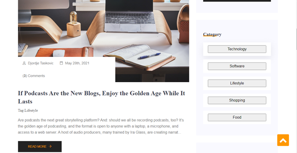
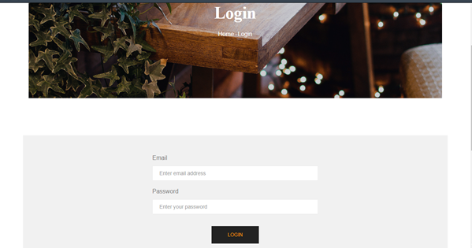
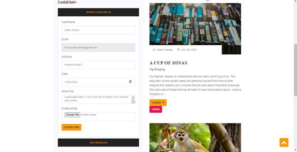

# Blogger Website

Welcome to our Blogger Website, a dynamic platform for bloggers to create, update, and share their content with the world. This web application is built using native PHP, follows an MVC (Model-View-Controller) structure, and utilizes a MySQL database for efficient data management.
## Screanshots
</img>
</img>
</img>
</img>
## Features

- **User-friendly Blogging:** Easily create, edit, and publish your blog posts through an intuitive and user-friendly interface.

- **Secure Data Handling:** We prioritize the security of your data. User authentication and MySQL database ensure that your content is stored safely.

- **MVC Architecture:** The website follows the MVC architectural pattern, making it highly maintainable and extensible.

